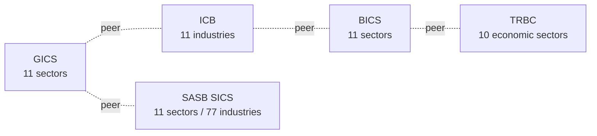

# Financial Systems

> **TL;DR:** WoT hosts ~55 financial classification systems: industry-vendor sector trees (Bloomberg BICS, Refinitiv TRBC, ICB, GICS Bridge, SASB SICS), the FIBO ontology (2,521 OWL classes), instrument and messaging codes (CFI, SWIFT MT, ISO 20022, XBRL, corporate actions), accounting standards (US GAAP, IFRS), banking and prudential regulation (Basel III, EU Taxonomy, SFDR, TNFD), 30+ curated domain finance taxonomies (derivatives, credit ratings, hedge funds, payments, FinTech, RegTech, InsurTech, microfinance), and emerging crypto vocabularies (token standards, DeFi protocols). This page maps which system to use when, and how the major ones connect.

---

## What this layer is for

Financial systems classify *capital, instruments, counterparties, transactions, and obligations*  -  orthogonal to general-purpose industry codes (NAICS, ISIC) and process frameworks (APQC PCF). A bank might be NAICS 5221 (Depository Credit Intermediation), Basel III IRB-eligible, ICB 30 (Financials), Refinitiv TRBC sector "Banking Services", and FIBO `BankingProductsAndServices` simultaneously  -  each anchor serves a different downstream surface.

This layer matters when downstream products need to:

- Classify a security for trade reporting (CFI for ISO 10962 standardized classification).
- Score an issuer for ESG (SASB SICS for sector materiality, SFDR for EU sustainable-finance disclosures).
- Map a corporate action for back-office processing (Corporate Actions / ISO 20022 / SWIFT MT).
- Categorize a fintech product against regulatory and product taxonomies (RegTech / FinTech domain taxonomies + reg_* frameworks).
- Anchor counterparty risk against an industry-vendor sector hierarchy (BICS, TRBC, ICB).
- Build a unified financial-data semantic layer (FIBO).

## Industry vendor sector trees (the "BICS / TRBC / ICB / GICS / SASB" cluster)

Five competing financial industry hierarchies. Each is the de-facto sector taxonomy on a different platform; portfolio teams routinely map between them.

| System | Codes | Maintained by | Used in |
|--------|-------|---------------|---------|
| `bloomberg_bics` | 13 | Bloomberg | Bloomberg Terminal, BQuant |
| `refinitiv_trbc` | 13 | LSEG / Refinitiv | Eikon, Workspace, World-Check |
| `icb` | 32 | FTSE Russell | FTSE indexes, LSE listings |
| `ftse_icb_detail` | 12 | FTSE Russell | Detailed ICB sub-sectors |
| `gics_bridge` | 11 | MSCI / S&P | MSCI indexes, S&P 500 sector splits |
| `sasb_sics` | 86 | SASB / IFRS Foundation | ESG materiality assessment |



These are deliberate competitors; none subsumes the others. SASB is special-purpose (ESG materiality, formally adopted by the IFRS Foundation in 2022), so it's used alongside one of the other four for risk + materiality reporting.

## Financial Industry Business Ontology (FIBO)

| Field | Value |
|---|---|
| System ID | `fibo` |
| Total classes | 2,521 |
| Authority | EDM Council |
| License | MIT |

FIBO is the largest financial system in WoT and the most semantically rigorous. It's an OWL ontology, not a flat code list  -  meaning each class has a formal definition, parent classes, and (often) restriction axioms. WoT ingests the class hierarchy across 7 modules:

| Module | What it covers |
|--------|----------------|
| BE | Business Entities (legal forms, ownership structures) |
| FBC | Financial Business and Commerce (markets, exchanges, jurisdictions) |
| FND | Foundations (concepts shared across the ontology) |
| SEC | Securities (equity, debt, structured products) |
| DER | Derivatives (forwards, futures, options, swaps) |
| IND | Indices and Indicators |
| LOAN | Loans (mortgages, syndicated loans, credit) |

Codes use module-prefixed local names (`SEC/Equity`, `BE/SoleProprietor`, `LOAN/Mortgage`) to disambiguate cross-module collisions. This is the right anchor when downstream products need a *typed* concept rather than a sector code: a "30-year fixed-rate mortgage to a sole proprietor" is `LOAN/FixedRateMortgage` issued to a `BE/SoleProprietor`, not just NAICS 5223.

## Accounting standards

| System | Codes | Authority | Scope |
|--------|-------|-----------|-------|
| `reg_us_gaap` | 33 | FASB | US Generally Accepted Accounting Principles (ASC codification) |
| `reg_fasb` | 19 | FASB | FASB Statements (parent of ASC) |
| `ifrs` | 34 | IFRS Foundation | International Financial Reporting Standards |
| `xbrl_taxonomy` | 14 | XBRL International | XBRL taxonomy concepts (machine-readable filings) |
| `reg_pcaob` | 28 | PCAOB | Public Company Accounting Oversight Board auditing standards |
| `reg_aicpa` | 21 | AICPA | American Institute of CPAs standards |

US GAAP and IFRS are the two top-of-funnel accounting frameworks. XBRL is the machine-readable serialization layer (SEC EDGAR filings, ESEF EU filings, etc.). PCAOB and AICPA cover audit standards over those filings.

## Instrument, messaging, and operational codes

The plumbing layer that moves financial data and trades.

| System | Codes | Authority | Scope |
|--------|-------|-----------|-------|
| `cfi_iso10962` | 63 | ISO | Classification of Financial Instruments (CFI) - 6-character code per security type |
| `swift_mt` | 13 | SWIFT | Legacy SWIFT MT message types (MT103, MT202, etc.) |
| `iso20022_msg` | 17 | ISO | ISO 20022 financial messaging schema (the modern replacement for SWIFT MT) |
| `corporate_action` | 19 | ISO 15022 / SWIFT | Corporate action event types (dividends, splits, mergers) |
| `card_schemes` | 15 | various | Major card schemes (Visa, Mastercard, Amex, UnionPay, JCB, Discover, RuPay, Mir, etc.) |

CFI is the universal instrument code; SWIFT MT and ISO 20022 are the message envelopes; corporate-action codes are the event vocabulary inside those envelopes.

## Banking, prudential, and sustainable finance regulation

Cross-references the [Regulatory Standards page](./regulatory-standards.md) for the full list; the financial-specific subset:

| System | Codes | Authority | Scope |
|--------|-------|-----------|-------|
| `reg_basel3` | 24 | BIS / BCBS | Basel III/IV bank capital and liquidity framework |
| `basel_exposure` | 36 | BIS | Basel exposure-class taxonomy (sovereign, bank, corporate, retail, etc.) |
| `reg_solvency2` | 22 | EIOPA | Solvency II (insurance prudential) |
| `reg_mifid2` | 24 | ESMA | Markets in Financial Instruments Directive II |
| `reg_psd2` | 19 | EBA | Payment Services Directive 2 (open banking) |
| `reg_dora` | 27 | ESAs | Digital Operational Resilience Act (financial-sector ICT risk) |
| `eu_taxonomy` | 60 | Commission | EU Taxonomy for sustainable activities |
| `sfdr` | 30 | ESAs | Sustainable Finance Disclosure Regulation |
| `reg_sfdr_detail` | 22 | ESAs | SFDR detailed RTS (regulatory technical standards) |
| `tnfd` | 34 | TNFD | Taskforce on Nature-related Financial Disclosures |
| `reg_csrd` | 25 | Commission / EFRAG | EU Corporate Sustainability Reporting Directive |

## Macro and development finance

| System | Codes | Authority | Scope |
|--------|-------|-----------|-------|
| `wb_income` | 27 | World Bank | World Bank country income classification (low / lower-middle / upper-middle / high) |
| `adb_sector` | 46 | ADB | Asian Development Bank sector taxonomy |

These show up when an organization's portfolio activity is anchored to development finance (DFI lending, multilateral aid, ODA reporting).

## Curated finance domain taxonomies

WoT-curated plain-language on-ramps for financial sub-domains (`domain_*`). These exist because no external standard covers the territory at this granularity in plain English.

### Banking and lending

| System | Nodes | What it covers |
|--------|-------|----------------|
| `domain_finance_instrument` | 25 | Cross-cutting instrument types (cash, equity, debt, derivatives, alternatives) |
| `domain_finance_market` | 18 | Market and exchange structure types |
| `domain_finance_client` | 19 | Client and investor segment types (retail, mass affluent, HNW, UHNW, institutional) |
| `domain_finance_regulatory` | 18 | Plain-language regulatory framework anchors |
| `domain_commercial_lending` | 16 | Commercial lending product types |
| `domain_mortgage_type` | 16 | Mortgage product types (fixed, ARM, jumbo, FHA, etc.) |
| `domain_securitization` | 17 | Asset-securitization structures (RMBS, CMBS, ABS, CLO) |
| `domain_muni_bond` | 15 | Municipal bond types |
| `domain_bond_rating` | 18 | Bond rating scale types |
| `domain_credit_rating` | 21 | Credit rating scale types (Moody's, S&P, Fitch grades) |
| `domain_microfinance` | 18 | Microfinance product and institution types |
| `domain_trade_finance` | 18 | Trade-finance instrument types (letters of credit, factoring, forfaiting) |

### Investment management

| System | Nodes | What it covers |
|--------|-------|----------------|
| `domain_wealth_mgmt` | 17 | Wealth management service types |
| `domain_hedge_fund` | 18 | Hedge fund strategy types (long/short, global macro, event-driven, etc.) |
| `domain_pe_stage` | 20 | Private equity stage types (seed, series A-E, growth, late-stage) |
| `domain_reit_type` | 17 | REIT subcategory types (equity, mortgage, diversified) |
| `domain_actuarial_method` | 16 | Actuarial methodology types |

### Trading and markets

| System | Nodes | What it covers |
|--------|-------|----------------|
| `domain_derivatives` | 22 | Derivatives instrument types (forwards, futures, options, swaps, structured) |
| `domain_commodity_trading` | 16 | Commodity trading types |
| `domain_forex` | 15 | FX instrument types |

### Insurance

| System | Nodes | What it covers |
|--------|-------|----------------|
| `domain_insurance_product` | 25 | Insurance product types (life, P&C, health, specialty) |
| `domain_insurance_risk` | 25 | Insurance risk types |
| `domain_insurance_underwriting` | 15 | Underwriting approach types |
| `domain_insurance_claims` | 17 | Claim types |
| `domain_reinsurance` | 18 | Reinsurance arrangement types |

### Payments and FinTech

| System | Nodes | What it covers |
|--------|-------|----------------|
| `domain_payment_proc` | 21 | Payment processing types |
| `domain_digital_banking` | 21 | Digital banking service types |
| `domain_fintech_service` | 27 | FinTech service categories |
| `domain_regtech` | 27 | RegTech service categories |
| `domain_insurtech` | 26 | InsurTech service categories |

### Sustainable and emerging

| System | Nodes | What it covers |
|--------|-------|----------------|
| `domain_carbon_credit` | 18 | Carbon credit instrument types |
| `token_standard` | 15 | Crypto token standards (ERC-20, ERC-721, ERC-1155, BEP, SPL, etc.) |
| `defi_protocol` | 15 | DeFi protocol categories (DEX, AMM, lending, derivatives, yield, oracle) |

## Which system to use

| Purpose | Recommended system | Why |
|---------|-------------------|-----|
| Classifying a public-equity issuer for portfolio reporting | One of `gics_bridge` / `icb` / `bloomberg_bics` / `refinitiv_trbc` (pick the one your platform uses) | These are the canonical industry sector trees on each major platform |
| Classifying a security for trade reporting | `cfi_iso10962` | The international standard CFI code |
| Classifying a corporate action for STP processing | `corporate_action` + `iso20022_msg` | Event vocabulary + message envelope |
| Counterparty financial reporting | `ifrs` or `reg_us_gaap` (jurisdiction-dependent) | Top-of-funnel accounting standards |
| Bank capital and exposure reporting | `reg_basel3` + `basel_exposure` | Prudential framework + exposure-class taxonomy |
| ESG materiality assessment | `sasb_sics` | Designed for materiality, formally adopted by IFRS Foundation |
| EU sustainable-finance product disclosure | `eu_taxonomy` + `sfdr` + `reg_sfdr_detail` | EU-mandated combination |
| Insurance prudential reporting (EU) | `reg_solvency2` + `domain_insurance_*` | Regulatory + curated product taxonomies |
| Building a typed financial knowledge graph | `fibo` | OWL ontology with formal class definitions |
| Categorizing a fintech / RegTech / InsurTech vendor | `domain_fintech_service` / `domain_regtech` / `domain_insurtech` | Plain-language curated buckets |
| Classifying a crypto token or DeFi protocol | `token_standard` + `defi_protocol` | Emerging-tech vocabularies WoT curates because no stable external standard exists yet |

## Crosswalk navigation

```bash
# Get the GICS to ICB peer mapping for a sector
GET /api/v1/systems/gics_bridge/nodes/40/equivalences

# Translate a CFI code to FIBO type
GET /api/v1/systems/cfi_iso10962/nodes/ESVUFR/translations

# Find all FIBO classes in the SEC (Securities) module
GET /api/v1/search?q=Equity&systems=fibo

# Browse the Basel exposure-class hierarchy
GET /api/v1/systems/basel_exposure/nodes
```

The richest crosswalk surface today is between `gics_bridge`, `icb`, `bloomberg_bics`, and `refinitiv_trbc`. CFI to FIBO and Basel to FIBO are queued for a follow-up PR.

## What WoT does not host

- **MSCI ESG Ratings**  -  proprietary methodology, not a published taxonomy.
- **Bloomberg / Refinitiv detailed sub-industries** beyond what their public sector trees publish.
- **Internal credit-rating scales** of individual banks (proprietary).
- **OFR Financial Stability indicators** as a structured taxonomy  -  published as a dashboard, not a code list.
- **Exchange-specific instrument lists** (NYSE listed equities, etc.)  -  these are operational data, not classification systems (per inclusion policy).
- **Wikidata Q-numbers** for individual companies  -  entity registry above the size cap.

## Related reading

- [Regulatory Standards](./regulatory-standards.md) - Basel III, MiFID II, Solvency II, SFDR, CSRD detail.
- [Industry Classification Guide](./industry-classification.md) - NAICS / ISIC / NACE overlap with the financial industry trees.
- [Inclusion Policy](./inclusion-policy.md) - why proprietary scores and entity registries are out.
