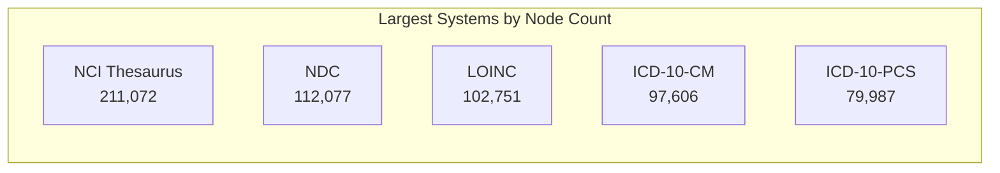

## Systems Catalog - All 1,000+ Classification Systems

> **TL;DR:** Complete catalog of 1,000+ classification systems organized by category. Industry (150+), Life Sciences (100+), Product/Trade (20+), Occupation (15+), Regulatory (100+), and 300+ domain vocabularies - all connected by 321K+ crosswalk edges.

---



World Of Taxonomy connects over 1,000 classification systems as equal peers in a unified knowledge graph. Systems span industry classification, product and trade codes, occupation standards, health and clinical coding, education frameworks, financial and environmental standards, regulatory compliance, and hundreds of domain-specific vocabularies.

## Industry classification standards

These are the foundational systems for classifying economic activity by industry sector.

### Global and Multi-National

| System | Region | Codes | Authority |
|--------|--------|-------|-----------|
| ISIC Rev 4 | Global (UN) | 766 | United Nations Statistics Division |
| ISIC Rev 3.1 | Global (historical) | ~400 | United Nations |
| GICS Bridge | Global (MSCI/S&P) | 11 | MSCI and S&P Dow Jones |
| ICB | Global (FTSE Russell) | 32 | FTSE Russell |

### North America

| System | Region | Codes | Authority |
|--------|--------|-------|-----------|
| NAICS 2022 | North America | 2,125 | U.S. Census Bureau |
| NAICS 2017 (Historical) | North America | ~2,000 | U.S. Census Bureau |
| NAICS 2012 (Historical) | North America | ~2,000 | U.S. Census Bureau |
| SIC 1987 | USA/UK | 1,176 | U.S. OMB |

### European Union (NACE Rev 2 Family)

NACE Rev 2 is the EU standard. Each member state publishes a national adaptation with the same structure (996 codes):

NACE Rev 2 (EU), ATECO 2007 (Italy), NAF Rev 2 (France), WZ 2008 (Germany), ONACE 2008 (Austria), NOGA 2008 (Switzerland), PKD 2007 (Poland), SBI 2008 (Netherlands), SNI 2007 (Sweden), DB07 (Denmark), TOL 2008 (Finland), CNAE 2009 (Spain), NACE-BEL 2008 (Belgium), CAE Rev 3 (Portugal), CZ-NACE (Czech Republic), TEAOR 2008 (Hungary), CAEN Rev 2 (Romania), and 20+ more national variants.

### Asia-Pacific

| System | Region | Codes | Authority |
|--------|--------|-------|-----------|
| NIC 2008 | India | 2,070 | Ministry of Statistics |
| JSIC 2013 | Japan | 20 | Ministry of Internal Affairs |
| ANZSIC 2006 | Australia/NZ | 825 | ABS/Stats NZ |
| GB/T 4754-2017 | China | 118 | National Bureau of Statistics |
| KSIC 2017 | South Korea | 108 | KOSTAT |
| SSIC 2020 | Singapore | 21 | Dept of Statistics |

### Latin America (ISIC-based)

CIIU Rev 4 adaptations: Colombia, Argentina, Chile, Peru, Ecuador, Bolivia, Venezuela, Costa Rica, Guatemala, Panama, Paraguay, Uruguay, Dominican Republic - each with 766 codes based on ISIC Rev 4.

### Additional National Systems

Over 80 country-specific ISIC Rev 4 adaptations covering Africa, Middle East, Central Asia, Southeast Asia, Caribbean, and Pacific Island nations.

## Product and Trade Classification

| System | Region | Codes | Purpose |
|--------|--------|-------|---------|
| HS 2022 | Global (WCO) | 6,960 | International trade (customs tariffs) |
| CPC v2.1 | Global (UN) | 4,596 | Product classification (statistical) |
| UNSPSC v24 | Global (GS1 US) | 77,337 | Procurement and spend analysis |
| SITC Rev 4 | Global (UN) | 77 | Trade statistics |
| BEC Rev 5 | Global (UN) | 29 | Broad economic categories |
| HTS (US) | United States | 120 | US customs tariff |
| CN 2024 | European Union | 118 | EU Combined Nomenclature |

## Occupation and Skills Classification

| System | Region | Codes | Purpose |
|--------|--------|-------|---------|
| ISCO-08 | Global (ILO) | 619 | International occupation standard |
| SOC 2018 | United States | 1,447 | US occupation classification |
| O*NET-SOC | United States | 867 | Occupation database with skills data |
| ESCO Occupations | Europe (EU) | 3,045 | European occupation taxonomy |
| ESCO Skills | Europe (EU) | 14,247 | Skills and competences |
| NOC 2021 | Canada | 51 | Canadian occupations |
| UK SOC 2020 | United Kingdom | 43 | UK occupations |
| ANZSCO 2022 | Australia/NZ | 1,590 | AU/NZ occupations |

## Life Sciences

| System | Region | Codes | Purpose |
|--------|--------|-------|---------|
| ICD-11 MMS | Global (WHO) | 37,052 | Disease classification (latest) |
| ICD-10-CM | United States | 97,606 | US clinical modification |
| ICD-10-PCS | United States | 79,987 | US procedure coding |
| LOINC | Global | 102,751 | Laboratory and clinical observations |
| MeSH | Global (NLM) | 31,124 | Medical subject headings |
| ATC WHO 2021 | Global (WHO) | 6,440 | Anatomical therapeutic chemical |
| NCI Thesaurus | Global (NCI) | 211,072 | Cancer research terminology |
| NDC | United States | 112,077 | National drug codes |

## Education Classification

| System | Region | Codes | Purpose |
|--------|--------|-------|---------|
| ISCED 2011 | Global (UNESCO) | 20 | Education levels |
| ISCED-F 2013 | Global (UNESCO) | 122 | Fields of education |
| CIP 2020 | United States | 2,848 | Instructional programs |

## Geographic Classification

| System | Region | Codes | Purpose |
|--------|--------|-------|---------|
| ISO 3166-1 | Global | 271 | Country codes |
| ISO 3166-2 | Global | 5,246 | Subdivision codes |
| UN M.49 | Global | 272 | Geographic regions |
| EU NUTS 2021 | European Union | 124 | Statistical regions |
| US FIPS | United States | 86 | Federal information processing |
| GeoNames Features | Global (GeoNames) | 693 | Geographic feature classification (admin, hydrographic, populated places, terrain, undersea, vegetation) |

## Financial, Environmental, and Governance

| System | Region | Codes | Purpose |
|--------|--------|-------|---------|
| COFOG | Global (UN) | 188 | Government functions |
| GHG Protocol | Global (WRI) | 20 | Greenhouse gas accounting |
| SASB SICS | Global | 86 | Sustainability accounting |
| EU Taxonomy | European Union | 60 | Sustainable finance |
| SFDR | European Union | 30 | Financial disclosure regulation |
| SDG 2030 | Global (UN) | 82 | Sustainable development goals |

## Regulatory and Compliance

Over 100 regulatory frameworks including HIPAA, SOX, GDPR, OSHA standards, FDA regulations, SEC rules, PCI DSS, NIST frameworks, ISO management system standards, and international agreements (Basel, FATF, ILO Conventions).

## Domain-Specific Vocabularies

Over 300 domain taxonomies covering specialized sectors:

- **Transportation**: truck freight types, vehicle classes, cargo classification, carrier operations, pricing, regulatory compliance
- **Agriculture**: crop types, livestock, farming methods, commodity grades, equipment, input supply, land classification
- **Mining**: mineral types, extraction methods, reserve classification, equipment, safety
- **Construction**: trade types, building types, project delivery, materials, sustainability
- **Manufacturing**: process types, quality, operations models, industry verticals
- **Healthcare deep-dives**: hospital departments, nursing specialties, lab categories, surgical specialties, pharmacy types
- **Finance deep-dives**: insurance products, credit ratings, derivatives, private equity stages
- **Technology**: API architectures, database types, programming paradigms, DevOps, MLOps, cybersecurity
- **Energy**: oil grades, natural gas, solar, wind, battery, smart grid, carbon credits

## Web and Semantic Vocabularies

These vocabularies define types and concepts used by AI assistants, search engines, and structured-data crawlers. They anchor what real-world things mean across the public web.

| System | Region | Codes | Authority | Purpose |
|--------|--------|-------|-----------|---------|
| schema.org | Global | 926 | schema.org consortium (Google, Microsoft, Yahoo, Yandex) | Type vocabulary for marking up web pages and JSON-LD structured data (Article, Person, Restaurant, MedicalCondition, etc.) |
| SKOS | Global (W3C) | 17 | W3C | Simple Knowledge Organization System reference |
| W3C Standards | Global | 16 | W3C | W3C standards index |
## Financial Ontologies

| System | Region | Codes | Authority | Purpose |
|--------|--------|-------|-----------|---------|
| FIBO | Global | 2,521 | EDM Council | Financial Industry Business Ontology - class hierarchies for business entities, instruments, derivatives, indices, loans, securities |

## Financial Ontologies

| System | Region | Codes | Authority | Purpose |
|--------|--------|-------|-----------|---------|
| FIBO | Global | 2,521 | EDM Council | Financial Industry Business Ontology - class hierarchies for business entities, instruments, derivatives, indices, loans, securities |

## Lexical Resources

| System | Region | Codes | Authority | Purpose |
|--------|--------|-------|-----------|---------|
| WordNet (Nouns) | Global | 82,115 | Princeton University | Lexical semantic database; noun hypernym tree rooted at entity.n.01. Anchors common-sense concept relationships for NLP and AI reasoning. |

## Patent Classification

| System | Region | Codes | Purpose |
|--------|--------|-------|---------|
| Patent CPC | Global (EPO/USPTO) | 254,249 | Cooperative Patent Classification |

## Academic and Research

| System | Region | Codes | Purpose |
|--------|--------|-------|---------|
| arXiv Taxonomy | Global | 110 | Preprint subject areas |
| MSC 2020 | Global | 92 | Mathematics subject classification |
| PACS | Global | 70 | Physics and astronomy |
| LCC | Global | 111 | Library of Congress classification |
| JEL Codes | Global | 98 | Economics literature |
| ACM CCS 2012 | Global | 67 | Computing classification |

## How to Explore Systems

Use these API calls to explore the catalog programmatically:

```bash
# List all systems
curl https://worldoftaxonomy.com/api/v1/systems

# Group by region
curl "https://worldoftaxonomy.com/api/v1/systems?group_by=region"

# Filter by country
curl "https://worldoftaxonomy.com/api/v1/systems?country=DE"

# System detail with root codes
curl https://worldoftaxonomy.com/api/v1/systems/naics_2022
```
